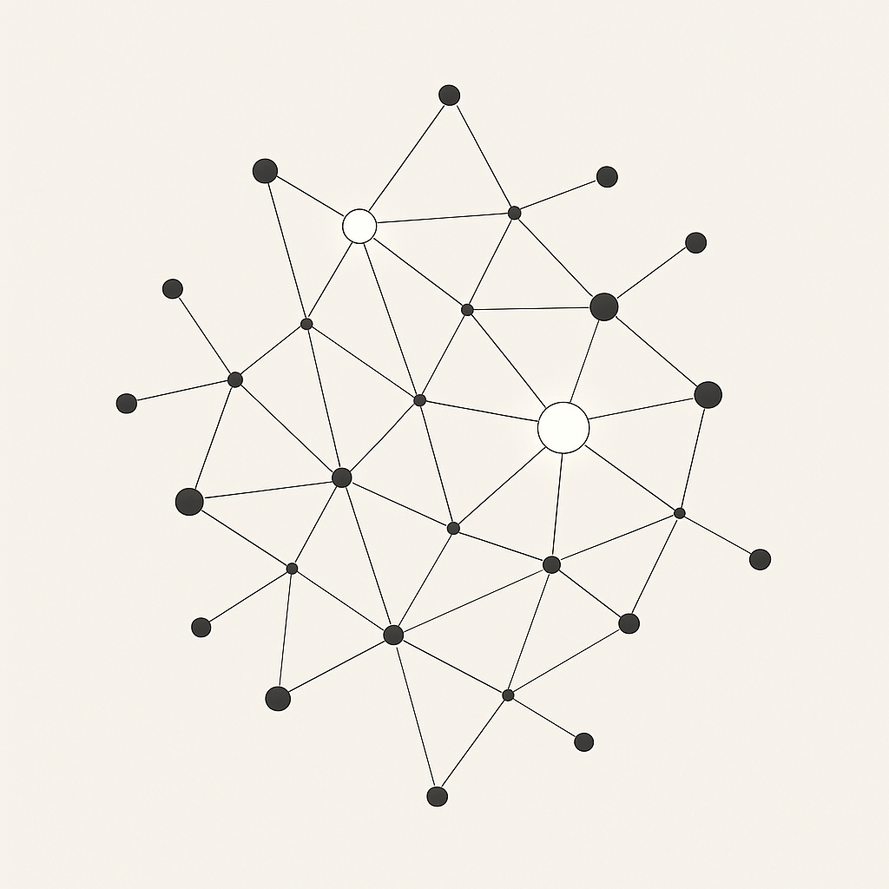

# KOTA Rust CLI

<p align="center">
  
</p>

KOTA is an advanced interactive Rust CLI that provides both a sophisticated Terminal User Interface (TUI) and a classic command-line interface for AI-assisted code editing and development tasks. It integrates with multiple LLM providers and features comprehensive vim-style navigation, intelligent file editing, command execution, and context management capabilities.

## Philosophy: A Cognitive Partner in Code

KOTA is designed to be more than just a command-line tool – it's a cognitive partner that augments your capabilities in software development and complex knowledge work. Built with the vision of becoming an increasingly autonomous AI agent, KOTA embodies several key principles:

### 🚀 Self-Improving System
KOTA has the unique ability to modify its own source code. When guided by users, it can iteratively enhance its capabilities, add new features, and evolve over time. This self-modification loop (supported by the `run_kota.sh` wrapper) represents a step toward truly adaptive software.

### 🧠 Deep Contextual Understanding
The tool excels at managing and utilizing context – from your project files to its own source code and interaction history. Through its context management system, KOTA maintains awareness of what it's working on and can make informed, relevant suggestions.

### 🤖 Intelligent Autonomy
While remaining user-directed, KOTA strives for increasing autonomy. It can break down complex tasks, execute multi-step operations, and leverage command outputs to make follow-up decisions – all with appropriate user oversight.

### 🛡️ Safety & Control
Despite its autonomous capabilities, KOTA prioritizes user control and safety:
- **File Access Control**: Can only edit files explicitly added to its context
- **Confirmation Required**: All file changes and commands require user approval
- **Transparent Operations**: Shows exactly what it's doing and why

### ⚡ Rapid Adaptability
In the fast-evolving AI landscape, KOTA is designed to adapt at the speed of innovation. Through its self-modification capabilities and modular architecture, it can quickly integrate new models, adopt emerging tools, and evolve its capabilities as the AI ecosystem advances. This ensures KOTA remains cutting-edge without requiring complete rewrites or architectural overhauls.

### 🔮 Future Vision
KOTA represents an exploration of distributed cognition – where human and AI capabilities merge to create something more powerful than either alone. It's a step toward a future where AI partners can handle significant portions of complex work, allowing humans to focus on higher-level thinking and creativity.

## Features

### 🖥️ Advanced Terminal User Interface (TUI)
- **Multi-pane layout**: Chat history, terminal output, context view, and file browser
- **Auto-scrolling chat**: Smart auto-scroll with manual override (toggle with 'a' key)
- **Enhanced command display**: Clear command suggestions with status indicators
- **Individual command execution**: Navigate commands with 'n'/'p', execute selected with 'x'
- **Multi-line input support**: Smart detection of code blocks, brackets, and line continuations
- **Vim-style navigation**: Full hjkl navigation with arrow key alternatives
- **Interactive file browser**: Navigate directories, add files to context
- **Real-time updates**: Live display of time, git branch, file counts, scroll mode
- **Responsive design**: Automatic content scaling and truncation for clean display
- **Professional layout**: Strict content boundaries prevent text bleeding between panes

### 🤖 AI-Powered Development
- **AI-Powered Code Editing**: Uses Search/Replace blocks to suggest and apply precise code changes
- **Enhanced Command System**: LLMs suggest commands with clear status tracking and individual execution
- **Context Management**: Maintain conversation context by adding files and code snippets
- **Knowledge Base Integration**: Automatic conversation storage and retrieval system
- **Auto-Commit**: Automatically creates git commits with AI-generated commit messages
- **Multiple LLM Providers**: Works with Claude/Anthropic (default), Google Gemini, and Ollama (local)
- **Autonomous Command Execution**: AI can automatically execute agent, security, and memory commands without user approval
- **Multi-Agent Framework**: Complete agent system with specialized agents for coding, planning, and research
- **Advanced Security**: macOS-focused sandboxing, policy engine, and approval system for safe command execution

### 🔧 Developer Experience
- **Advanced Input Handling**: Multi-line input with smart detection and visual feedback
- **Vim Bindings**: Full vim-style editing and navigation throughout the interface
- **Markdown Rendering**: Enhanced display of headers, code blocks, and formatting
- **File Safety**: Strict access control - can only edit files explicitly added to context
- **Checkbox Feedback**: Clear visual indicators for context operations (`Context: [x] filename`)
- **Persistent Memory**: Automatic knowledge base with conversation history and learning
- **Zero Warnings**: Passes strictest Rust linting with 63+ comprehensive tests
- **Professional Quality**: Zero-tolerance policy for warnings and dead code

## Prerequisites

- [Rust](https://rustup.rs/) (latest stable version)

### For Claude/Anthropic (Cloud LLM) - Default
- Anthropic API key from [Anthropic Console](https://console.anthropic.com/)
  ```bash
  export ANTHROPIC_API_KEY=your_api_key_here
  ```

### For Google Gemini (Cloud LLM) - Alternative
- Google Gemini API key from [Google AI Studio](https://ai.google.dev/)
  ```bash
  export GEMINI_API_KEY=your_api_key_here
  ```

### For Ollama (Local LLM) - Alternative
- [Ollama](https://ollama.ai/) running locally with a compatible model
  ```bash
  brew install ollama
  ollama pull qwen3:8b
  ollama serve
  ```

## Installation

```bash
git clone <repository-url>
cd kota-rust-cli
cargo build --release
```

## Usage

### Start KOTA (TUI Mode - Default)
```bash
cargo run
```

The TUI provides an interactive multi-pane interface with professional layout and responsive design:

#### TUI Navigation
- **i** - Enter insert mode to type messages
- **Esc** - Return to normal mode
- **f** - Enter file browser mode
- **a** - Toggle auto-scroll mode in chat (AUTO/MANUAL indicator)
- **Tab** - Cycle through panes (Chat → Terminal → Context → File Browser)
- **hjkl / ↑↓←→** - Navigate and scroll within panes
- **n/p** - Navigate through command suggestions (when terminal focused)
- **x** - Execute selected command or all commands
- **?** - Show help and keyboard shortcuts
- **Ctrl+Q** - Quit application

#### TUI Workflow
1. **Browse files**: Press 'f' to open file browser, navigate with hjkl, Enter to add files
2. **Chat with AI**: Press 'i' to enter insert mode, type your message, press Enter
3. **Execute commands**: AI suggestions appear in terminal pane, press Tab to focus, 'x' to execute
4. **Review changes**: File edits are applied with confirmation, auto-commits created

### Available Commands (Both TUI and CLI)

#### Context Management
- `/add_file <path>` - Add file contents to context
- `/add_snippet <text>` - Add text snippet to context  
- `/show_context` - Display current context
- `/clear_context` - Clear all context

#### Command Execution
- `/run <command>` - Execute shell command
- `/run_add <command>` - Execute shell command and add output to context

#### Git Operations
- `/git_add <file>` - Stage file for commit
- `/git_commit "<message>"` - Create git commit
- `/git_status` - Show git status
- `/git_diff [<path>]` - Show git diff

#### Agent Commands (Autonomous)
- `/agents` - List available agents
- `/agent <name>` - Get agent capabilities
- `/delegate <task>` - Delegate task to best agent
- `/ask_agent <question>` - Ask question to agent

#### Security Commands (Autonomous)
- `/security [status]` - Show security system status
- `/sandbox [profile]` - Configure sandbox profiles
- `/approval [mode]` - Configure approval settings

#### Memory & Knowledge Base Commands (Autonomous)
- `/memory` - Show recent conversation summaries
- `/search <query>` - Search knowledge base for specific topics
- `/learn <topic>: <content>` - Add specific learning to knowledge base

#### Configuration Commands (Require Approval)
- `/provider <anthropic|gemini|ollama>` - Switch between LLM providers
- `/config [show|save|load|reset]` - Manage configuration
- `/help` - Show all available commands
- `/quit` - Exit application

### AI Interactions

Simply type natural language prompts to interact with the AI:

```
You: Add error handling to the main function
```

The AI can respond with:
1. **File edits** using Search/Replace blocks
2. **Commands** to build, test, or manage the project
3. **Explanations** and guidance
4. **Autonomous agent commands** (executed automatically)

### Example Workflows

#### TUI Workflow
1. **Start KOTA**: `cargo run` (launches TUI by default)
2. **Add files to context**: Press 'f', navigate to files, press Enter to add
3. **Send message**: Press 'i', type "Add better error handling", press Enter
4. **Execute commands**: AI suggestions appear in terminal, press Tab to focus terminal, 'x' to execute
5. **Review changes**: File edits are applied automatically after confirmation

#### Agent Delegation Workflow
```bash
# Ask AI to delegate a complex task
You: I need to refactor this codebase to use async/await patterns throughout

# AI responds with autonomous agent commands:
🤖 Executing autonomous AI commands:
→ /agents
→ /delegate refactor codebase to use async/await patterns
→ /agent code_agent

# AI provides detailed plan and begins execution
```

#### Self-Modification Workflow
```bash
# Use the wrapper script for automatic rebuild/restart
./run_kota.sh

# Inside KOTA, ask it to improve itself
You: Add a new command /version that shows the current version of KOTA

# KOTA will:
# 1. Request to read its own source: /add_file src/main.rs
# 2. Generate S/R blocks to add the feature
# 3. Apply changes and create a commit
# 4. Exit with code 123 to trigger rebuild

# The wrapper script automatically rebuilds and restarts KOTA with new features!
```

## Architecture

### Core Components
- **Terminal User Interface**: Advanced multi-pane TUI with professional layout and responsive design
- **LLM Integration**: Supports Claude/Anthropic (default), Google Gemini, and Ollama (local)
- **Search/Replace Parser**: Parses structured file edit suggestions
- **Enhanced Command System**: Individual command execution with status tracking and autonomous execution
- **File Editor**: Handles interactive file modifications with safety checks
- **Context Manager**: Maintains conversation context with strict access control
- **Memory Manager**: Persistent knowledge base with automatic conversation storage
- **File Browser**: Interactive navigation with sudo support
- **Multi-Agent Framework**: Complete agent system with manager, code agent, planning agent, and research agent
- **Security Framework**: macOS-focused sandboxing, policy engine, and user approval system
- **Configuration System**: TOML-based configuration with persistence and management

### Multi-Agent Architecture

KOTA includes a complete multi-agent framework with working implementations:

#### Available Agents
- **CodeAgent**: Specialized in code analysis, generation, and editing
- **PlanningAgent**: Expert in task breakdown, project planning, and resource allocation
- **ResearchAgent**: Focused on information gathering, web search, and data analysis

#### Agent Features
- **Autonomous Execution**: Agents can execute commands without user approval
- **Task Delegation**: Intelligent routing of tasks to the most suitable agent
- **Shared Context**: All agents share the same context and knowledge base
- **Concurrent Operations**: Multiple agents can work simultaneously
- **Extensible Design**: Easy to add new specialized agents

#### Agent Commands
```bash
/agents                    # List all available agents
/agent code_agent         # Get code agent capabilities
/delegate analyze this code # AI selects best agent automatically
/ask_agent how should I structure this project? # Direct agent query
```

### Security Architecture (macOS)

KOTA includes a comprehensive security framework designed for macOS:

#### Security Layers
- **macOS Seatbelt Sandboxing**: Process isolation using sandbox-exec
- **Policy Engine**: Regex-based command filtering with customizable rules
- **Approval System**: Interactive user prompts with risk assessment
- **Command Classification**: Autonomous vs approval-required command detection

#### Security Features
- **Three Sandbox Profiles**: Minimal, development, and read-only modes
- **Policy-Based Filtering**: Allow/deny rules with pattern matching
- **Risk Assessment**: Automatic evaluation of command safety
- **Configuration-Driven**: TOML-based security policies and settings

### Quality Standards
- **Zero Clippy Warnings**: Passes `cargo clippy -- -D warnings` with no issues
- **Comprehensive Testing**: 63+ tests covering all core functionality including TUI, agents, and security
- **Dead Code Elimination**: No unused code (framework code uses `#[allow(dead_code)]` for future features)
- **Memory Safety**: Safe async patterns with proper mutex handling
- **Error Handling**: Robust error handling with `anyhow` throughout
- **Professional Display**: Strict content boundaries prevent UI corruption

### Knowledge Base & Memory System

KOTA automatically maintains a persistent knowledge base that enhances every interaction:

#### Automatic Features
- **Conversation Storage**: All chats automatically summarized and stored with timestamps
- **Domain Organization**: Knowledge organized by subject areas (personal, projects, systems, core)
- **Privacy Protection**: Local-only storage with .gitignore ensuring personal content stays private
- **Context Integration**: Past knowledge automatically informs current conversations

#### Manual Commands
- `/memory` - View recent conversation summaries and learning
- `/search <query>` - Search across stored knowledge for specific topics
- `/learn <topic>: <content>` - Add specific insights or information to the knowledge base

#### Knowledge Structure
```
knowledge-base/
├── personal/          # Identity, career, finance, journaling
├── projects/          # Active and historical projects
├── systems/           # Tools, workflows, technical knowledge
└── core/             # Conversation management, partnerships
```

## Development

```bash
# Build
cargo build

# Run tests (63+ comprehensive tests)
cargo test

# Run tests including ignored sandbox tests
cargo test -- --ignored

# Format code
cargo fmt

# Lint code (strict mode - zero warnings)
cargo clippy -- -D warnings
```

## Configuration

### Claude/Anthropic (Cloud) - Default
Set your API key as an environment variable:
```bash
export ANTHROPIC_API_KEY=your_api_key_here
```
- Default model: `claude-sonnet-4-20250514` (Claude 4 Sonnet)
- Timeout: 240 seconds (4 minutes)

### Google Gemini (Cloud) - Alternative
Set your API key as an environment variable:
```bash
export GEMINI_API_KEY=your_api_key_here
```
- Default model: `gemini-2.5-pro-preview-05-06`
- Timeout: 360 seconds (6 minutes)

### Ollama (Local)
Ensure Ollama is running with your preferred model:
```bash
ollama serve
```
- Default model: `qwen3:8b`
- Timeout: 120 seconds (2 minutes)

### Provider Switching
Switch providers in both TUI and CLI:
```bash
/provider anthropic # Use Claude/Anthropic (default)
/provider gemini    # Use Google Gemini
/provider ollama    # Use local Ollama
```

### Prompts Configuration
Customize KOTA's behavior by editing `prompts.toml`:
- System prompts and instructions
- Autonomous command access permissions
- Commit message generation templates
- Command execution guidelines
- Search/Replace format specifications

### Security Configuration (macOS)
KOTA includes a comprehensive security framework:
- **Sandbox Profiles**: Minimal, read-only, and development sandboxing modes
- **Policy Engine**: Command filtering with allow/deny rules
- **Approval System**: User confirmation for commands with risk assessment
- **TOML Configuration**: Full security customization via config files

## Contributing

1. Fork the repository
2. Create a feature branch
3. Make your changes
4. Add tests if applicable
5. Ensure `cargo clippy -- -D warnings` passes
6. Submit a pull request

## TODO

### Live Data Integration with MCP
- [ ] Implement custom MCP servers for live data ingestion
  - [ ] WebSocket MCP Server for real-time streams
  - [ ] Kafka MCP Bridge for event streaming
  - [ ] RSS/News MCP Server for content feeds
  - [ ] Database Change Stream MCP for data sync
- [ ] Create MCP server framework for rapid adapter development
- [ ] Document MCP server creation patterns and best practices
- [ ] Build example implementations for common data sources

### Advanced Agent Features
- [ ] Agent learning and adaptation system
- [ ] Cross-agent communication protocols
- [ ] Task queue and priority management
- [ ] Agent performance monitoring and metrics

### Enhanced Security Features
- [ ] Windows and Linux security framework support
- [ ] Advanced threat detection and prevention
- [ ] Security audit logging and compliance
- [ ] Integration with external security tools

## License

This project is open source. See LICENSE file for details.